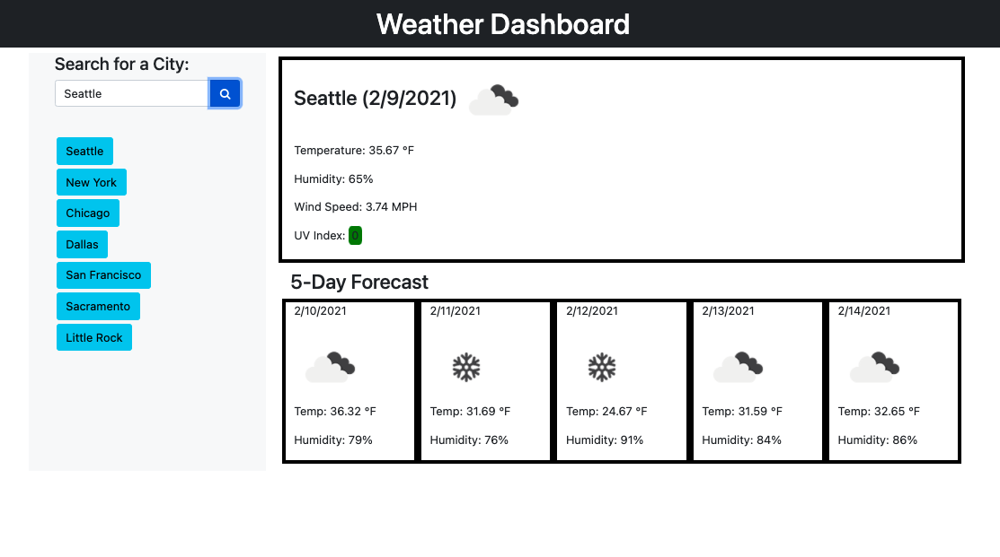

# Weather_Dashboard

## Description

The motivation for building this application was the desire to create an application that uses jQuery and the [OpenWeather third-party API](https://openweathermap.org/api) in order to dynamically update HTML and CSS. This application also uses the Web Storage API.

The reason for building this specific project was the need for an application that displays the weather outlook for a selected city.

The OpenWeather API was used for retrieving the current day's temperature, humidity, wind speed, and uv index. It was also used to display the temperature and humidity for the following 5 days.

Some challenges faced during ths project were ensuring the correct interpretation and implementation of the information received from the OpenWeather API, and ensuring that the API calls worked in tandem with the rest of the application. 

## Application Image(s)

## Installation

No prior installation is required to use the Weather Dashboard application.

## Usage

1. Head to the deployed link that is provided further down.
1. On first use the application will only display the Weather Dashboard header and a search field.
1. Type in the name of the city for which you would like weather information.
1. You will then see a display with the city name, current date, temp, humidity, wind speed,  uv index, and an icon representing the weather conditions.
1. Below that you will view the forecast for the following five days. Each day will display the date, temp, humidity, and an icon representing the weather conditions.
1. The 7 most recent cities that you searched for will be saved on the left-hand side under the search field.
    1. You can click on any of the cities in order to display the weather outlook for that city.
1. When you return to the application you will see the weather outlook for the last city that you manually searched for.

## Deployed Link

https://martinmondaca.github.io/Weather_Dashboard/

## Technologies Used

* https://jquery.com/
* https://getbootstrap.com/
* https://fontawesome.com/
* https://openweathermap.org/api

## License

Licensed under [MIT](https://choosealicense.com/licenses/mit/) license.